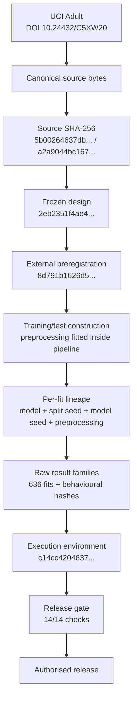

# Governance audit report

> Generated by `scripts/render_governance_audit.py` from committed evidence. 
> Do not edit this file manually; regenerate it and let `--check` verify drift.

## Executive status

| Control | Evidence | Status |
| --- | --- | --- |
| Dataset identity | UCI Adult DOI `10.24432/C5XW20` + 2 source SHA-256 values | PASS |
| Frozen design | `2eb2351f4ae40971a5428c7aa6bbf3f906826ade0f99054abd56e03e3275d7d9` | PASS |
| External preregistration | `8d791b1626d524822c0f72c7190353dcf5553cdee3918b57a81d89d33a06c0be` at `v0.7.1` | PASS |
| Execution environment | `c14cc420463715659168dec7058de3c10a3d24fe6fc1a2003869102f1209e23a` | PASS |
| Raw fit coverage | 636 committed fits across 4 families | PASS |
| Release gate | 14/14 checks passed | PASS |

## Lineage



## Governed identities

| Identity | Value |
| --- | --- |
| Dataset DOI | `10.24432/C5XW20` |
| `adult.data` SHA-256 | `5b00264637dbfec36bdeaab5676b0b309ff9eb788d63554ca0a249491c86603d` |
| `adult.test` SHA-256 | `a2a9044bc167a35b2361efbabec64e89d69ce82d9790d2980119aac5fd7e9c05` |
| Design-lock SHA-256 | `2eb2351f4ae40971a5428c7aa6bbf3f906826ade0f99054abd56e03e3275d7d9` |
| Preregistration capsule SHA-256 | `8d791b1626d524822c0f72c7190353dcf5553cdee3918b57a81d89d33a06c0be` |
| Configuration SHA-256 | `38e00a77351a4f7697dce339af03d40ac8aa175568345d046f4acee4900c4833` |
| Environment SHA-256 | `c14cc420463715659168dec7058de3c10a3d24fe6fc1a2003869102f1209e23a` |
| Immutable preregistration reference | `v0.7.1` |
| Primary data retrieval time | `2026-08-29T21:03:42.656357+00:00` |

## Raw result families

| Experiment | Fits | Result | Result SHA-256 | Manifest |
| --- | ---: | --- | --- | --- |
| `split_sensitivity` | 120 | `results/adult/split_sensitivity.csv` | `0350b0e2f9af5bf3464eeddabf55627e74a65b45243f493b33476e025b008abd` | `results/adult/split_sensitivity.manifest.json` |
| `seed_sensitivity` | 120 | `results/adult/seed_sensitivity.csv` | `e3f9344656b3ecebbc37576aa254d13b83e996c319b75f630608612b249fc0fb` | `results/adult/seed_sensitivity.manifest.json` |
| `preprocessing_sensitivity` | 12 | `results/adult/preprocessing_sensitivity.csv` | `c3c53e2b334a770877ebde339d24a8ed28142ab599132544c104f1032ce9e618` | `results/adult/preprocessing_sensitivity.manifest.json` |
| `factorial` | 384 | `results/adult/factorial.csv` | `7d303ca4959a20bffcfc7c18b5e43f0dac49ec98c3c1b9e60953a54d21757770` | `results/adult/factorial.manifest.json` |
| **Total** | **636** | | | |

## Per-fit lineage fields

Each raw fit exposes the reconstruction and behavioural metadata declared by `governance/lineage_contract.json`:

```text
experiment
model
split_seed
model_seed
preprocessing
n_train
n_test
converged
convergence_warning_count
n_iter
accuracy
balanced_accuracy
f1
roc_auc
score_kind
n_unique_scores
score_abs_median
prediction_sha256
score_sha256
```

## Release gate

| Check | Status | Evidence |
| --- | --- | --- |
| `design_lock` | **PASS** | prospective design lock verified |
| `reference_environment` | **PASS** | canonical runtime verified |
| `external_anchor` | **PASS** | remote preregistration capsule matches the prospectively locked design |
| `dataset` | **PASS** | dataset provenance verified |
| `raw_split_sensitivity` | **PASS** | exact run grid and manifest verified |
| `raw_seed_sensitivity` | **PASS** | exact run grid and manifest verified |
| `raw_preprocessing_sensitivity` | **PASS** | exact run grid and manifest verified |
| `raw_factorial` | **PASS** | exact run grid and manifest verified |
| `environment_consistency` | **PASS** | all raw families agree |
| `analysis_manifest` | **PASS** | verified |
| `baseline_consistency` | **PASS** | verified |
| `deterministic_controls` | **PASS** | verified |
| `derived_tables` | **PASS** | verified |
| `full_empirical_replay` | **PASS** | verified |

## Explicit scope boundaries

These are intentionally **not** claimed by this research repository:

| Capability | Implemented here? |
| --- | --- |
| `production_model_registry` | **No** |
| `separate_validation_set_registry` | **No** |
| `rbac` | **No** |
| `pii_retention_enforcement` | **No** |
| `deployment_lineage` | **No** |

## Regenerate and verify

```bash
python scripts/render_governance_audit.py
python scripts/render_governance_audit.py --check
```

The report is an audit surface over the completed study. It does not alter the frozen scientific specification or any published result.
